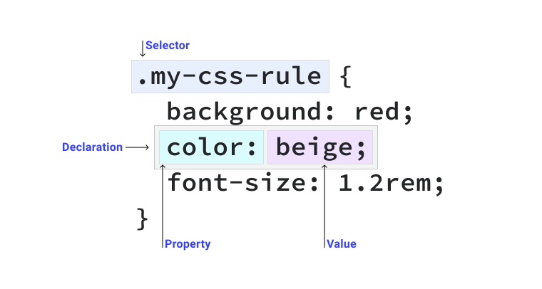

# Class 2, 2026/02/09

## Intro (20min)

- *A website you like* (Laura, Anastasia, Anita)

## Tutorial: A clean working document (15min)

- Your project has its project own folder.
- Inside your project folder, you have an html file named `index.html`.
- Inside your project folder, you have a subfolder called `assets`, and in that folder, you have a subfolder for your `CSS`, and one for your `Javascript`.
- Inside your `css` subfolder you have your `style.css` file.
- Inside your `js` subfolder you have your `script.js` file.

```
your-project-folder

   ├── index.html
   ├── content
   └── assets
       ├── css
       │   └── style.css
       └── js
           └── script.js
```

You link your style.css and script.js files in your html document.

For `style.css`:

- For the `style.css` document, this should be inside the <head> of your html document.
- `<link rel="stylesheet" href="assets/css/style.css">`

For `script.js`:

- For the `script.js` document, this should be at the end of your html document.
- `<script src="assets/js/script.js"></script>`

## Tutorial: HTML (1h)

- HTML (1h)
- Overview of possible HTML tags, [W3school, by category](https://www.w3schools.com/TAGS/ref_byfunc.asp), [W3School, semantic HTML](https://www.w3schools.com/html/html5_semantic_elements.asp)
- - `<div>` and `<span>` vs. `<section>`, `<article>`, `<nav>`...
  - Paragraphs (`<p>`), headings (`<h1>`-`<h6>`), inline formatting (`<em>`, `<strong>`)
  - Hyperlinks (`<a>`), and its attributes
  - ``, `<iframe>`, `<video>`, `<audio>`.
  - `<figure>`, `<figcaption>`
  - `<ul>`, `<ol>`, `<li>`
  - `<summary>` and `<details>`
- How to use developer tool
  - Google Chrome -> [Shift]+[Cmd]+[C], or `View -> Developer Tools` | Firefox -> [Alt]+[Cmd]+[I], or `Tools -> Browser tools -> Web development tools`.
  
## Presentation assignment 1

[See dedicated page](https://github.com/francois-gm/go-kabk-y1/tree/main/2025-2026-Y1B/02%20-%20Assignment%201%20(ode%20to%20CSS))

## (15min break)

...

### Small developer tool exercice (15min)

- Do 'command + shift + C' (the shortcut for accessing your browser's *developer tools*)
- Create a new stylesheet rule from your browser inspector (click on the '+' button in Chrome):

```
// '*' means 'every elements'

* {
 outline: 1px solid #F00;
}
```

Look at the page, resize it, and look at how blocks behave. Can you see each HTML tags?

## Tutorial: CSS (1h)

You can [download a project template there](https://github.com/francois-gm/go-kabk-y1/blob/main/2025-2026-Y1A/02%20-%2020260209%20-%20HTML/my-project-template.zip)
(click on the three dots button `...` on the top right of your screen and then `download`)

> What is CSS?

CSS stands for **C**ascade **S**tyle **S**heet.

1. It behaves like a **cascade**.
2. It **styles** the HTML elements (it's like painting the HTML blocks).
3. It is a **sheet**.
   
But what does **behaves like a cascade** means? It means that:

- You at first apply style rules that are general: they apply to all your elements, and are not very specific. As an example, **all paragraphs** have a **blue color**.
- The you apply style rules that are more specific. As an example, **the paragraph with a red class** has a **red color**. All other paragraphs will keep their blue color.
- In summary: All paragraphs have a blue color, paragraphs with the red class has a red color.

```
p{
  color:blue;
}

p.red{
  color:red;
}
```

## Principles of CSS:

- Precedence and priority (the cascade)
- Selectors types and granularity in selecting.
- The CSS **property-value** pair, as an example `color: blue;` where `color` is the property and `blue` is the value.
- Pseudo classes (`a:hover`) apply to specific states (when the mouse hovers the `<a>` element, this CSS rules applies).



### Selectors

CSS selectors are used to “find” (or select) the HTML elements you want to style.

#### Simple selectors

- The **element** selector
  - In HTML: `<p>`
  - In CSS: `p{ property:value; }`
  - Not very specific, less CSS 'cascade points'.
- The **class** selector
  - In HTML: `<p class="my-class">`
  - In CSS: `p.my-class{ property:value; }`
  - More specific than an *element* selector, more CSS 'cascade points'.
  - You can have several elements sharing the same *class* in your HTML document.
- The **id** selector
  - In HTML: `<p id="my-id">`
  - In CSS: `p#my-id{ property:value; }`
  - More specific than a class selector, so even more CSS 'cascade points'.
  - An id is unique, meaning you can only use each id once per html document.

#### Combinator selectors

Select elements based on a specific relationship between them.

Example 1:

- `p.my-class a.my-other-class`
- Applies to `<a>` elements with the class `"my-other-class"` inside `<p>` elements with the class `"my-class"`
- More specific than simple selector, so even even more CSS cascade points. The more specific, the more points, the more 'deep' in the cascade, the more it has precedence over less specific CSS rules.

Example 2:

- `div.my-class p:first-of-type`
- Applies to the first `<p>` element inside a `<div>` element with the class `"my-class"`
- Again, more specific than simple selector, so even even more CSS cascade points. The more specific, the more points, the more 'deep' in the cascade, the more it has precedence over less specific CSS rules.

In example 2, we also have a **pseudo-class** selector, the `:first-of-type` selector.

> A CSS pseudo-class is a keyword added to a selector that specifies a special state of the selected element(s).

[Read more about pseudo-class selectors on MDN](https://developer.mozilla.org/en-US/docs/Web/CSS/Pseudo-classes)

## CSS *properties* and *values*

*A CSS property determines an HTML element's style or behavior. Examples include font style, transform, border, color, and margin.*

- [CSS properties almanac on CSS tricks.com](https://css-tricks.com/almanac/properties/)
- [Basic CSS properties on simmons.edu](http://web.simmons.edu/~grabiner/comm244/weekthree/css-basic-properties.html)
- [All CSS properties on W3school](https://www.w3schools.com/cssref/index.php)
- [CSS tutorial W3school](https://www.w3schools.com/css/default.asp)

## Exercise (15min)

- Complete levels 1-15 on [the CSS Diner](https://flukeout.github.io).
