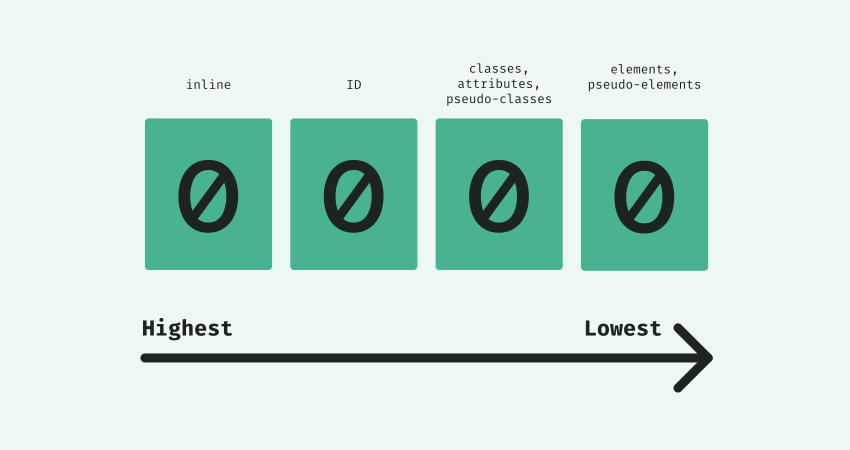

# Class 5, 2025/10/06

## Intro (15min)

- *A website you like* (Finn, Erwin, Antonina, François)

## About Monday October 27th's workshop…

- Guess tutor class with [Doriane Timmermans](https://ungual.digital).
- TBC will do a lunch lecture/presentation of their work (12h45-13h30) before that class, 1-2 students to create a visual for that (?)
  
## Recap (10min)

Questions:

- Why would one wants to add some `CSS` in project / what can CSS bring more to a `HTML` project?
- Name three ways to add CSS styles in an HTML document. Can you tell us the plus and minuses of each method?
- What is the "cascade"?
- *I want to write a `CSS` selector to target an `HTML` element so I can style it...*
  - Name a **general** way of selecting that element
  - Name a **more specific** way of selecting that element (using **one** HTML `attribute`)
  - Name a **very specific** way to selecting that element (using **one** HTML `attribute`)
- **True** or **false**...
  - When writing a `CSS` selector, you can combine different `class` under one selector.
  - When writing a `CSS` selector, you can combine diffrent `id` under one selector.
  - You can give multiple `id` values to one `HTML` element.
  - Each HTML element needs to have its individual selector in order to be *styled* by CSS.
  - **General** `CSS` selector are **more important** than **specific ones** (and their styling overwrite specific ones).
- **Name three** examples of CSS properties and **what** they visually do.

Bonus:

- What was the most **common** coding "issue" experienced during previous class (guess: it's not really a ~~coding~~ mistake)?

## Tutorial: extending on CSS selectors (10min)

Last class, we saw several ways of writing *CSS selectors* to style our HTML elements.

In short: The more the combination is specific, the more it has 'cascade points' and the more it has precedence over other CSS rules.

But how does the 'CSS algorithm' actually works?



- Inline CSS = `1`-`0`-`0`-`0`
- Id = `0`-`1`-`0`-`0` (added for each in a matching selector)
- Class, pseudo-class, attribute = `0`-`0`-`1`-`0` (added for each in a matching selector)
- Element, pseudo-element, `0`-`0`-`0`-`1` (added for each in a matching selector)

### Read more

- [All CSS selectors on W3school](https://www.w3schools.com/cssref/css_selectors.php)
- [CSS selectors on web.dev](https://web.dev/learn/css/selectors?hl=en)
- [More about how specificity gets calculated](https://webdesign.tutsplus.com/what-is-css-specificity--cms-34141t)
- [Visual examples on specificity](https://www.w3schools.com/cssref/trysel.php?)
- Practice your selectors by [playing the CSS Diner](https://flukeout.github.io) game!
- ... or play [this other game](https://toolness.github.io/css-selector-game/)

## Tutorial: linking files (self-hosted vs. online, relative vs. absolute) (10min)

### Self-hosted

**The files are in your website folder** (you push them online, they are hosted under the url of your project).

#### Relative links

- `./` → Current folder (you can often skip this)
- `../` → Go *up one folder level* (to the parent folder)
- `../../` → Go *up two levels*
- `../../../` → Go *up three levels*, etc.

Common mistakes:

- ❌ Forgetting `../` → the browser looks in the same folder and fails to find the file.
- ❌ Too many `../` → you go above the root folder, which doesn’t exist.
- ✅ Always think in “steps”: each `../` goes one folder up.

`/`→ Start from the root of the website.

Example: 

```
https://example.com/
```

Doing something like...

```
<link rel="stylesheet" href="/css/style.css">
```

then `/css/style.css` means:

`https://example.com/css/style.css`

… even if the page in which the stylesheet link is like `https://example.com/content/subpage/sub-subpage/index.html`

### Hosted by a third party / online

#### Absolute link

Usually used as external links (point to other websites). Preferably **not used** for images in your website (if the hosting party deletes the images, your website does not display the images anymore).

Example: `<a href="https://www.another-website.com/another-link" target="_blank">Another link</a>`

An absolute link always has the `https://` starting the links, as well as the full domain of the website.

For images files, always prefer the **.jpg** format!

## Tutorial: layouting basics with CSS (1h)

We start with the blank template that we made in the previous class (download on this page). You can [download it there](https://github.com/francois-gm/go-kabk-y1/blob/main/2025-2026-Y1B/05%20-%2020251006%20-%20Assignment%20time/tutorial-layout/layout-setup.zip)

(click on the three dots button `...` on the top right of your screen and then `download`)

First, let's do a [CSS reset](https://meyerweb.com/eric/tools/css/reset/) or a [CSS normalize](https://nicolasgallagher.com/about-normalize-css/)

Then:

- Let's make a basic page layout with a *header*, a *sidebar*, a *main content section*, and a *footer*.
- We will use: relative positioning, absolute/fixed/sticky positioning.
- We will add some visual differentiation across elements.

(in other words):

- Layout properties: `display`, `position`, `float`, `clear`.
- Size: `width`, `height`.
- More styling properties (what would you like to see?)

Read more:

- [The box model](https://www.w3schools.com/css/css_boxmodel.asp): understand how borders, margin, and padding are calculated.

## Time for assignment (small groups) (1h30)

| Time | Group |
|-|-------------- |
| 15min | Isaac, Tosia, Nana, Francesco |
| 15min | Mia, Enola, Nora, Christina |
| 15min | Finn, Ye Gon, Sonia, Antrea |
| 15min | Erwin, Miruna, Martyna, Márk |
| 15min | Jordy, Gosha, Adriana |
