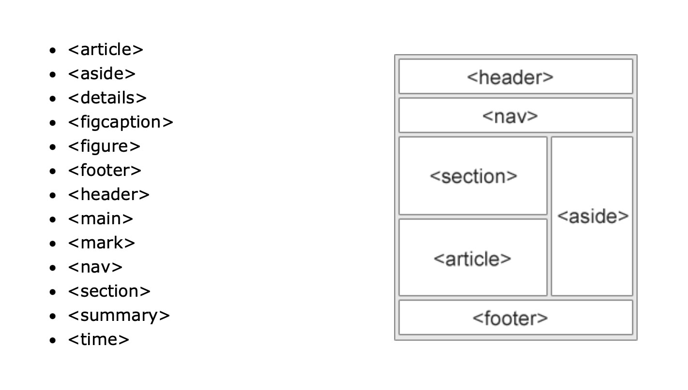

# HTML introduction
*(2026/09/07, at Hortus Botanicus Leiden)*

## Presentation of the class (1h30)

- Structure, assignments, assessement criteria (30min)
- Round table (names, pronoums, curiosities, anxieties) (30min)
- Text readings + round table (30min)

## Introduction (1h)

Presentation: An overview of HTML

[HTML tutorial on W3C school](https://www.w3schools.com/html/default.asp)

Semantic Elements in HTML

Many web sites contain HTML code like: <div id="nav"> <div class="header"> <div id="footer"> to indicate navigation, header, and footer.

In HTML there are some semantic elements that can be used to define different parts of a web page:



## Exercise

**XML ‘in-situ snapshot’ coding exercice (1h)**

Venture into the Hortus and find a location you want to document. Think about what you see but also what you hear and smell. 

Write the 'code' of the picture on a piece of paper. You do **not** write it in *HTML*. Instead, use the logic of XML languages:

- Tags that open and close
- Tags that contain other tags
- The use of attributes that give additional specific information about what the tag's content.

Don't forget to also **take a picture with your phone** of the scene/detail you are making a ‘coded snapshot’. We'll need these for next class.

More about XML:

- [List of XML languages on Wikipedia](https://en.wikipedia.org/wiki/List_of_XML_markup_languages)
- [BeerXML, a XML language for beer recipesl](https://beerxml.com/recipes.xml)
- [Epub, a XML for digital booksl](https://gist.github.com/stormwild/86673836eb6153e6ab2e65b4353a289e)
- [RecipeML, a XML for recipesl](https://en.wikipedia.org/wiki/RecipeML)
- [XML plant catalog on W3Schools](https://www.w3schools.com/xml/plant_catalog.xml)

Example:

```
<pond size=”small”>

  <surface status=”still”>

    <waterlilies>

      <waterlily blossom-count=”3”></waterlily>
      <waterlily blossom-count=”2”></waterlily>
      <waterlily blossom-count=”5”></waterlily>
      <frog status=”sleeping”></frog>

    </waterlilies>

  </surface>

  <underwater>

    <fish color=”red”></fish>
    <frog status=”active”></frog>

  </underwater>

</pond>
```
