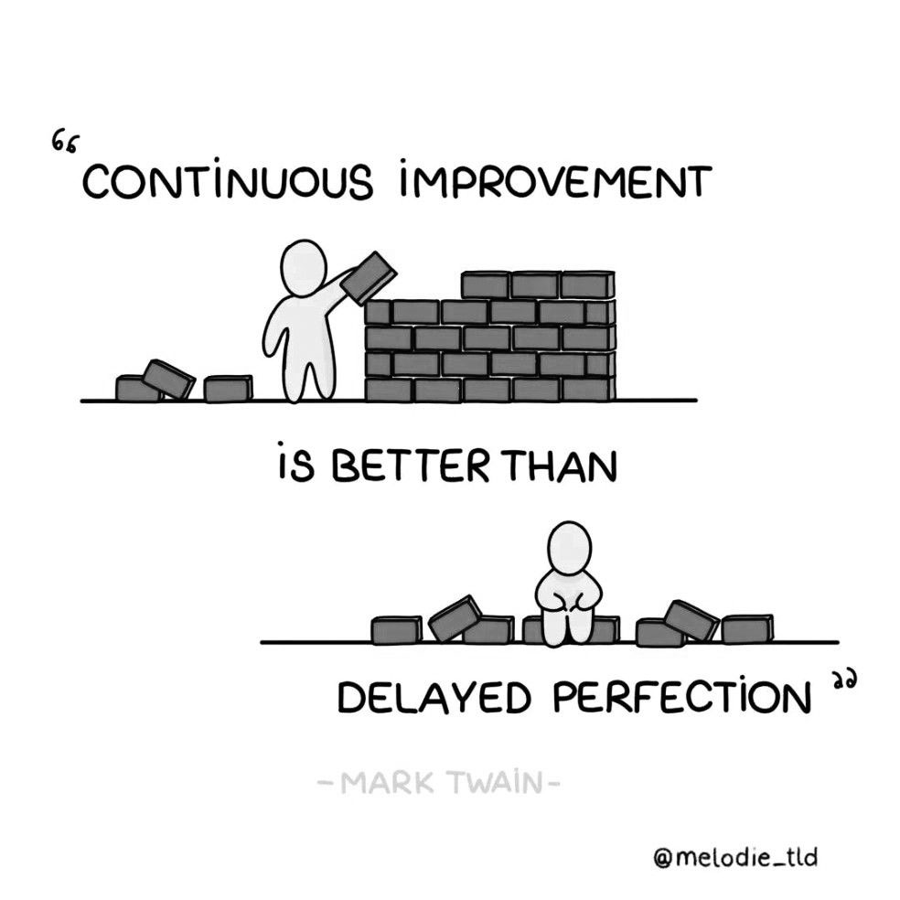

# Coding Y1B @ KABK, 2026–2027

*(inter)dependencies*

## The course

During this semester, we will unbox basics about coding, with a focus on the ‘web’ triad of HTML/CSS/Javascript. While doing so, we will develop an approach of *thinking through coding*. This means understanding how languages and their syntax systems work and the aspect and logic behind writing code. Via presentation and exercises, we will apply this logic conceptually without aiming too much at the technicalities of "production-oriented" code. In parallel, we will learn to look and talk about how we experience the web, in visual as well as navigational terms.

## Main assignments

In addition to in-class exercises, you will have two main assignments, each to be completed in a 4-5 weeks period.

## Small presentation assignment

*At the beginning of each class, 2–3 students will make a short presentation about a website they like, and tell us a bit more about it. I will also do the same.*

[A website you like, read more on the assignment page](https://github.com/francois-gm/go-kabk-y1/tree/main/2025-2026-Y1A/01-2%20-%20Assignment%2C%20A%20Website%20you%20like)

## Time schedule

Every Monday, 13h30–17h30, Classroom to be determined

First 15 minutes: web culture <br>
Small presentation assignment

2h-ish: presentations, workshop-based <br>
1h30-ish: exercices and class time for assignment

## Teaching methods, assessment methods, competencies, etc:

- [Course description and ECTS table](https://github.com/francois-gm/go-kabk-y1/blob/main/2026-2027-Y1B/2627_Y1-coding_courseDescription.pdf)
- [Assessment of coding competencies document](https://github.com/francois-gm/go-kabk-y1/blob/main/2026-2027-Y1B/2627_Y1-coding_competencies.pdf)
- [Learning contract](https://github.com/francois-gm/go-kabk-y1/blob/main/2026-2027-Y1B/2627_Y1-coding_learningContract.pdf)
- 
**Learning contract**

*A contract*

By following this class, and this study program, you agree to its learning terms. This is, in a way, similar to the concept of the social contract. Sometimes your studies might seem challenging, but you trust your teachers to provide you with an environment that fosters your personal, creative and technical growth. The learning goals are in the *assessment of coding competencies* document (up).

*Learning*

Learning coding is not just about technical 'code', it is a **philosophy** and **methodology** in itself. It is about a *way* to look at the world, (logical) problems, and come up with solutions. Therefore, the skills I wish you to develop through this semester are, besides knowledge foundations, to learn how to **unpack a problem**, **talk about it**, and do the appropriate **research to overcome it**.

Debugging, or solving coding problems, is a skill in itself. First how do you know your problem? You isolate it, you identify it. You describe the problem in plain english. You learn to use precise language, to use the right terminology to describe the issue. When you can describe it, then you search through various channels, online/offline, deep googling, etc. You come up with logical explainations of what the problem is, and what you can do to fix it. You try it, you try variations on it. You observe what happens.

*Self-learning*

One truth is that great coders keep on learning. The world of coding is in constant **evolution**, and you will **never do the same project twice**. Therefore, the aim is not to know 'how do I do this', but 'how do I proceed to find what I need to to do this'.

*Use of LLMs (AI)*

- AI tools can support this class learning process **when they are used as explanatory aids**. However, when AI is used to produce outcomes without understanding, it **undermines the learning goals** of the course. Therefore, AI may be used to explain concepts and errors, but may not be used to generate project structures or solutions you cannot explain. 
- It expected that students are **authors** of their code and projects. Authorship does not mean that 100% of the materials used for the work must be originally written character by character by the student. What it means is that there is a strong **sense of ownership** that can be **collectively agreed** through objective means.
- Understanding in this course does not mean knowing every keyword or remembering exact syntax. It means being able to reason about how the project works at the level of mechanisms. You should be able to explain the structure of your project, the role of its main components, and the cause-and-effect relationships between interactions, data, and visual output.

Acceptable uses of AI:

- Asking for explanations of concepts (e.g. variables, functions, async behavior).
- Asking why an error occurs or why something does not behave as expected.
- Requesting explanations of what existing code does, step by step.

Unnaceptable uses of AI:

- Asking AI to design or generate independent features and copying-pasting them in your project
- Having AI to generate structures of your project.
- Using AI to write blocks of code that you cannot explain afterwards.


### Prompts suggestions

The [Socractic Tutor Instruction Prompt (to be copied-pasted or uploaded)](https://github.com/francois-gm/go-kabk-y1/blob/main/2025-2026-Y1A/tutor-instruction-prompt.md)

Or (basic logic):
```
"I’m having a persistent problem with [x] despite having taken all the necessary countermeasures I could think of.
Ask me enough questions about the problem to find a new approach."
```



## Contact hours

I try to reply to your emails with flexibility, but sometimes it might take a few days (esp. if you email me during mid-week as our class is on Monday)

- Available by email via: f.girard-meunier@kabk.nl
- And also on Teams

